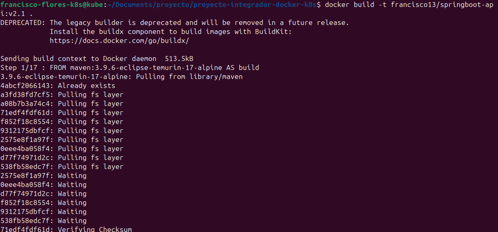
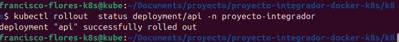
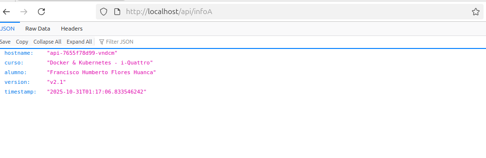
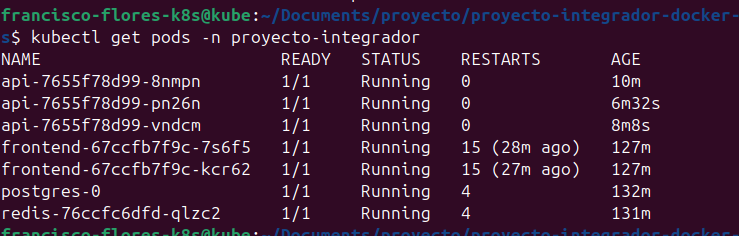
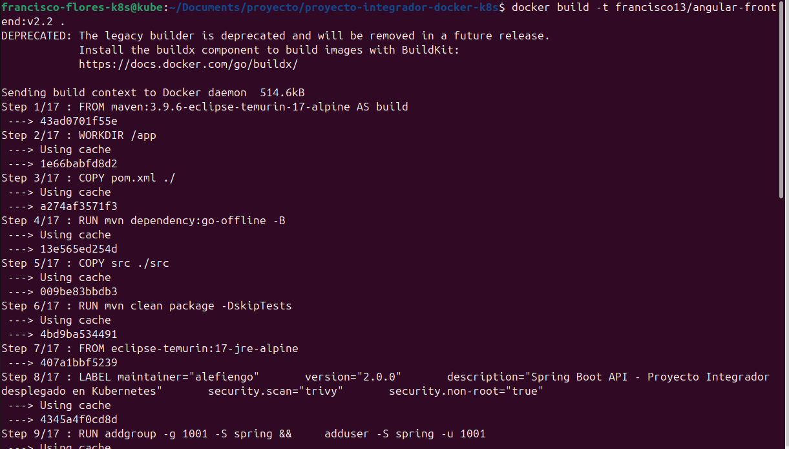
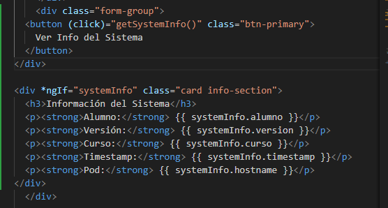
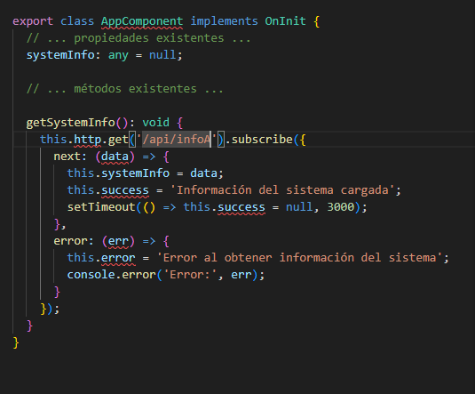
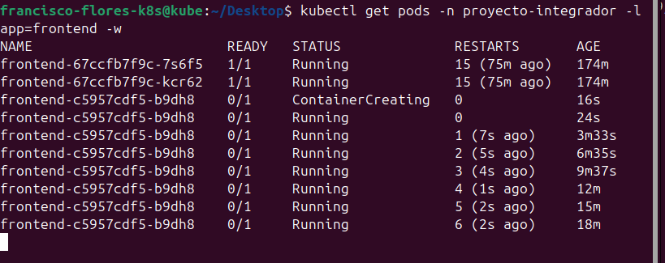
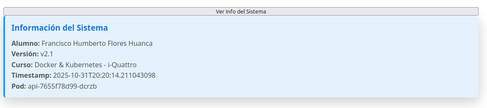

   # Proyecto Final - Docker & Kubernetes

   Alumno: Francisco Humberto Flores Huanca
   Fecha: 31/10/2025
   Curso: Docker & Kubernetes - i-Quattro

   ## Links de Docker Hub
   - Backend v2.1: https://hub.docker.com/repository/docker/francisco13/springboot-api/general
   - Frontend v2.2: https://hub.docker.com/repository/docker/francisco13/angular-frontend/general

   ## Parte 1: Setup del Ambiente

   **Ambiente utilizado:**
   - VirtualBox
   - Nombre de VM/Instancia: Francisco-Humberto-Flores-Huanca-k8s
   - Sistema operativo: Ubuntu 24.04 LTS
   - Recursos: 4GB RAM, 2 CPU cores
   - Red configurada: Bridged
   - Rango MetalLB: 10.241.2.240-10.241.2.250

   ### Screenshots
   ![microk8s status][def]

   ![Pods running][def2]

   ![Frontend][def3]

[def]: screenshots/parte1-microk8s-status.png
[def2]: screenshots/parte1-pods-running.png
[def3]: screenshots/parte1_frontend_browser.png

## Parte 2: Backend v2.1
Se adiciono el Endpoint en el controlador GreetingController
Se adiciono su import
Se aplicaron cambios a los deploments

### Código Agregado

import org.springframework.http.ResponseEntity;

@GetMapping("/api/infoA")
public ResponseEntity<Map<String, Object>> getInfo() {
    Map<String, Object> info = new HashMap<>();
    info.put("alumno", "Francisco Humberto Flores Huanca");
    info.put("version", "v2.1");
    info.put("curso", "Docker & Kubernetes - i-Quattro");
    info.put("timestamp", LocalDateTime.now().toString());
    info.put("hostname", System.getenv("HOSTNAME"));
    return ResponseEntity.ok(info);
}

### Screenshots








## Parte 3: Frontend v2.2
 Se realizo cambios en el frontend
### Screenshots








## Parte 4: Gestión de Versiones con Rollout

### Objetivo
Aprender a gestionar versiones de deployments usando comandos de rollout (rollback, rollforward, historial).

### Tareas

#### 4.1 Ver Historial de Rollouts

```bash
# Ver historial del backend
kubectl rollout history deployment/api -n proyecto-integrador

# Ver historial del frontend
kubectl rollout history deployment/frontend -n proyecto-integrador
```

**Salida esperada:**
```
REVISION  CHANGE-CAUSE
1         <none>
2         <none>
```

#### 4.2 Hacer Rollback a Versión Anterior

```bash
# Rollback del backend a v2.0
kubectl rollout undo deployment/api -n proyecto-integrador

# Ver el proceso
kubectl rollout status deployment/api -n proyecto-integrador

# Verificar que el endpoint /api/info ya NO existe
curl http://<IP-METALLB>/api/info
# Debería dar error 404
```

#### 4.3 Volver a la Versión v2.1 (Rollforward)

```bash
# Ver historial actualizado
kubectl rollout history deployment/api -n proyecto-integrador

# Rollback a la revisión 2 (que es v2.1)
kubectl rollout undo deployment/api --to-revision=2 -n proyecto-integrador

# Verificar
curl http://<IP-METALLB>/api/info
# Debería funcionar nuevamente
```

#### 4.4 Forzar Recreación de Pods

```bash
# Reiniciar deployment sin cambiar imagen (útil para debugging)
kubectl rollout restart deployment/api -n proyecto-integrador

# Ver los pods recreándose
kubectl get pods -n proyecto-integrador -w
```

**ACCIÓN REQUERIDA:** Captura los screenshots de todos los pasos de rollout (history, rollback, rollforward) solicitados en los Entregables Parte 4.

### Entregables Parte 4
- Screenshot de `kubectl rollout history` del backend
- Screenshot de `kubectl rollout history` del frontend
- Screenshot del proceso de rollback (undo)
- Screenshot verificando que `/api/info` dejó de funcionar después del rollback
- Screenshot del rollforward (undo --to-revision=2)
- Screenshot verificando que `/api/info` volvió a funcionar
- Explicación en tus propias palabras: ¿Qué hace `kubectl rollout undo`?

---