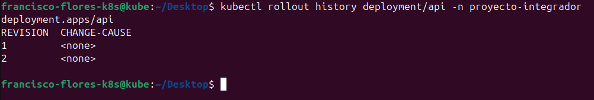
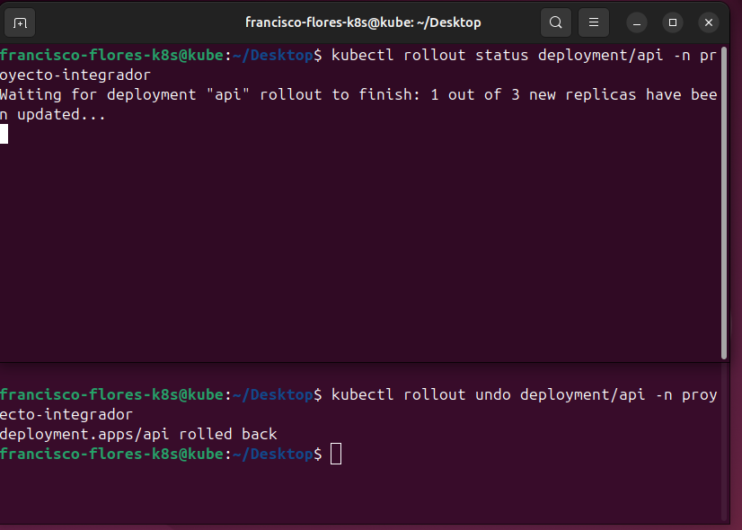
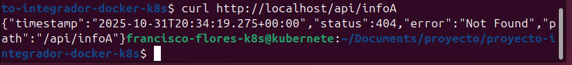
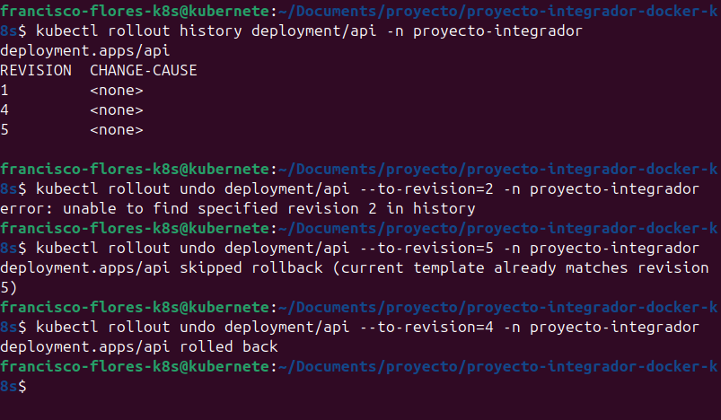
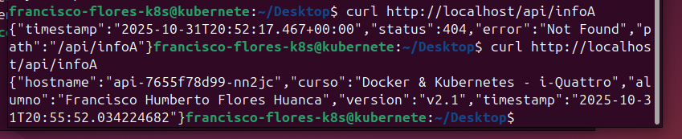
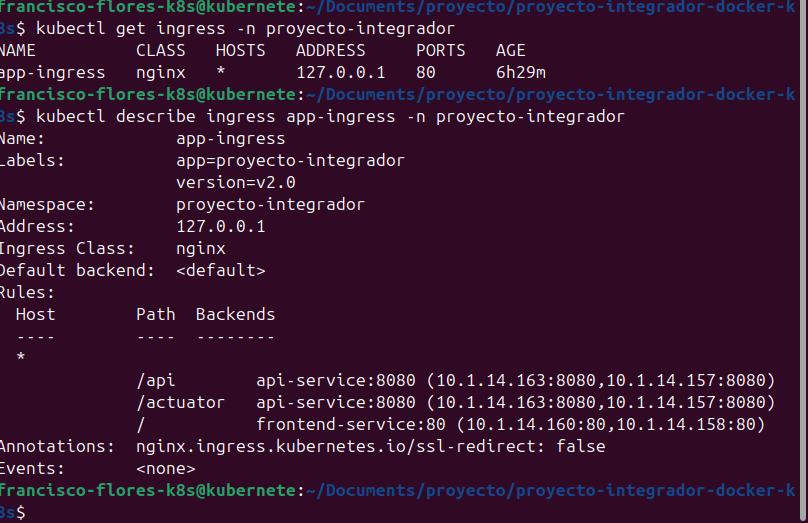

   # Proyecto Final - Docker & Kubernetes

   Alumno: Francisco Humberto Flores Huanca
   Fecha: 31/10/2025
   Curso: Docker & Kubernetes - i-Quattro

   ## Links de Docker Hub
   - Backend v2.1: https://hub.docker.com/repository/docker/francisco13/springboot-api/general
   - Frontend v2.2: https://hub.docker.com/repository/docker/francisco13/angular-frontend/general

   ## Parte 1: Setup del Ambiente

   **Ambiente utilizado:**
   - VirtualBox
   - Nombre de VM/Instancia: Francisco-Humberto-Flores-Huanca-k8s
   - Sistema operativo: Ubuntu 24.04 LTS
   - Recursos: 4GB RAM, 2 CPU cores
   - Red configurada: Bridged
   - Rango MetalLB: 10.241.2.240-10.241.2.250

   ### Screenshots
   ![microk8s status][def]

   ![Pods running][def2]

   ![Frontend][def3]

[def]: screenshots/parte1-microk8s-status.png
[def2]: screenshots/parte1-pods-running.png
[def3]: screenshots/parte1_frontend_browser.png

## Parte 2: Backend v2.1
Se adiciono el Endpoint en el controlador GreetingController
Se adiciono su import
Se aplicaron cambios a los deploments

### Código Agregado

import org.springframework.http.ResponseEntity;

@GetMapping("/api/infoA")
public ResponseEntity<Map<String, Object>> getInfo() {
    Map<String, Object> info = new HashMap<>();
    info.put("alumno", "Francisco Humberto Flores Huanca");
    info.put("version", "v2.1");
    info.put("curso", "Docker & Kubernetes - i-Quattro");
    info.put("timestamp", LocalDateTime.now().toString());
    info.put("hostname", System.getenv("HOSTNAME"));
    return ResponseEntity.ok(info);
}

### Screenshots

## Parte 3: Frontend v2.2
 Se realizo cambios en el frontend
### Screenshots

## Parte 4: Gestión de Versiones

### Objetivo
Aprender a gestionar versiones de deployments usando comandos de rollout (rollback, rollforward, historial).

### ¿Qué hace kubectl rollout undo?

Con el comando podemos volver a una version anterior en caso de falla de la version actual
o  volver de la anterior a la actual.
#### 4.1 Ver Historial de Rollouts

  ### Screenshots
- 
- 
- 
- 
- 
- 

## Parte 5: Ingress + MetalLB

   **IP del Ingress:** 10.241.2.240-10.241.2.250

   ### Screenshots
   
   

   ## Conclusiones

   ### Aprendizajes principales
   - Manajeo de docker
   - Conocer un poco mas de la publicacion de imagenes
   - Ver el proceso y uso de comandos de kubernete
   - Conocer como se implemente el deploymet
   - Manejo de errores

   ### Dificultades encontradas
   - El ingress no tenia una ip externa 
   - No se actualizaba los cambios de la imagen, habia que crear una imagne con otro tag
   
   ### Reflexión
   El manejo de imagenes para la implementacion de microservicios